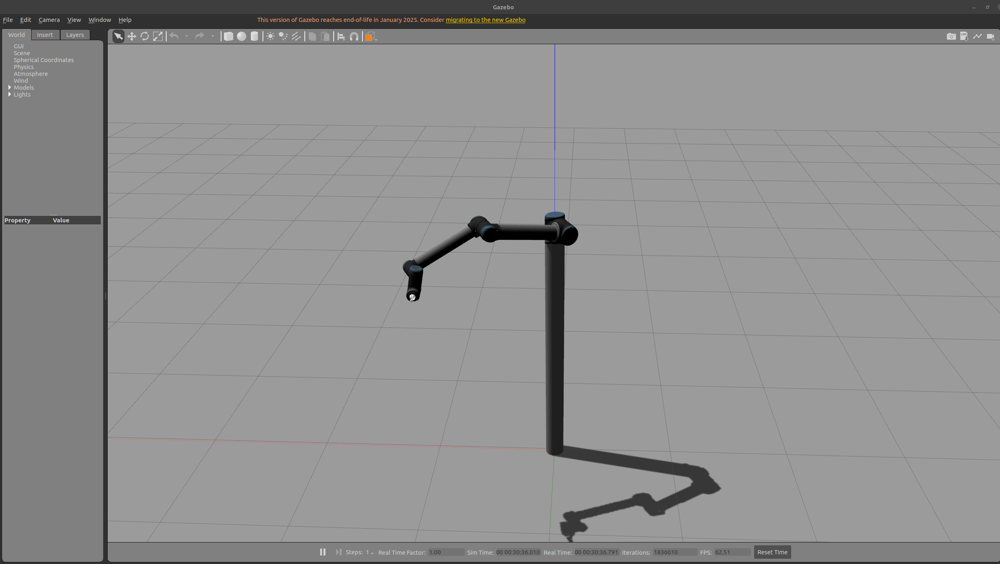

# Robot Arm with Kinematic and Inverse Kinematic

## Setup and Initialization of the Environment

For this assignment I used gazebo_plugins_rtg and we will initialize and use it.

The assignment includes the following package and the ur10_kinematics package developed by me. -https://gitlab.com/blm6191_2425b_tai/blm6191/gazebo_plugins_rtg

#### Installation

```
git clone https://gitlab.com/blm6191_2425b_tai/members/24501118/hw2.git
```

### Initializing the Environment

We come to the main folder.

```
cd ./hw2/robots_ws
```

We use our code to build the code just in case.

```
catkin_make clean
catkin_make
source devel/setup.bash
```

Then we start our environment.

```
roslaunch gazebo_plugins_rtg ur10.launch
```

When we do this, we wait for the gazebo to open. When the environment opens, we will see a robot arm (If these operations are done with root, there may be problems because the Gazebo GUI does not work very well with root, it would be healthier to do it with a normal user). Also, the simulation starts in a stopped state, we need to say start from the bottom of the GUI screen.

## Observing the Solution and Outputs

### Observing the Solution

All the codes I have solved are in the following location, you will find 2 solutions in this location.

```
hw1/robots_ws/src/ur10_kinematics
```

The first one is ur10_kinematics_node, this solution can edit the robot's shape using its kinematics. Let's run this solution with the following method.

```
rosrun ur10_kinematics ur10_kinematics_node
```

The second is ur10_trajectory_node, which is our code that can provide the robot's movements in the form of stepping when the D value is between 1 and -1. Now let's examine how these codes work.

```
rosrun ur10_kinematics ur10_trajectory_node
```

Use with example values

```
rosrun ur10_kinematics ur10_trajectory_node 0.7 0.7 0.7 0.7 0.1 0.1 0.1 0.1
```

If the D value, that is, the coordinate that the robot can reach, is greater than 1 or less than -1, it will give an error and will not be able to perform the operation. The calculated D values of the values you entered are printed on the screen, you can check them here.

### They came out

After running our kinematic code

```
rosrun ur10_kinematics ur10_kinematics_node
```

Our robot arm will take the following shapes.




Also (the other messages are from ur10_acilar's publish) our code will output as follows.


You can also see below the aggregate with RQT, where both the messages are broadcast, the code is executed and the output is observed.


When we run our Trajectory code, the robot will move in the form of stepping. It will step from the start position to the end position as shown below (here I ran the code below as an example, if you want to try different steps, you can check the steps as long as the D value is correct).

```
rosrun ur10_kinematics ur10_trajectory_node 0.7 0.7 0.7 0.7 0.1 0.1 0.1 0.1
```


When we follow the steps from the command line, it will provide output as follows.


